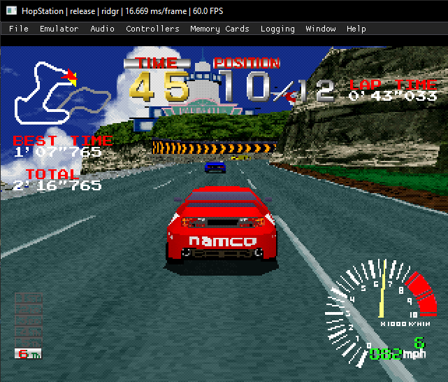
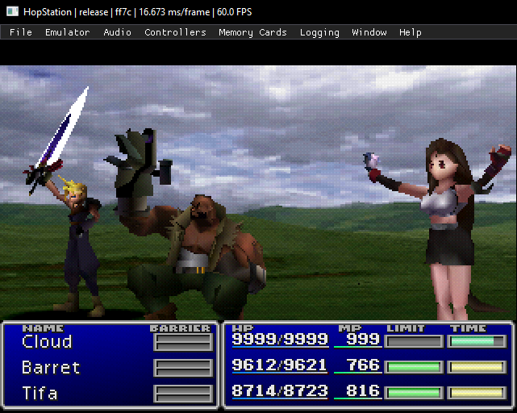
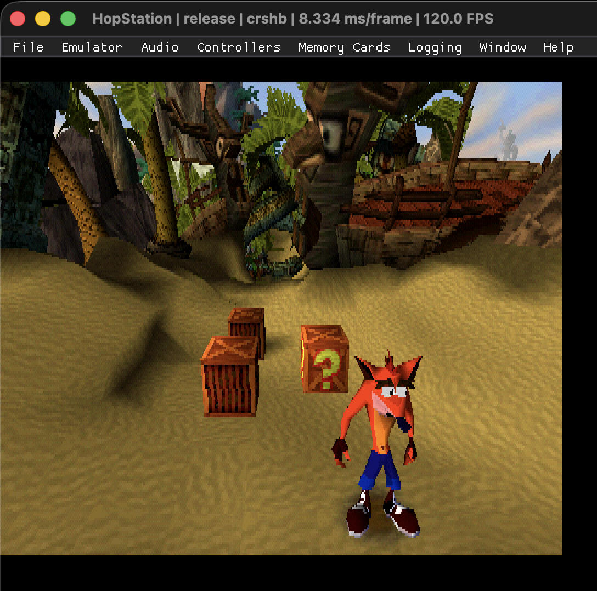
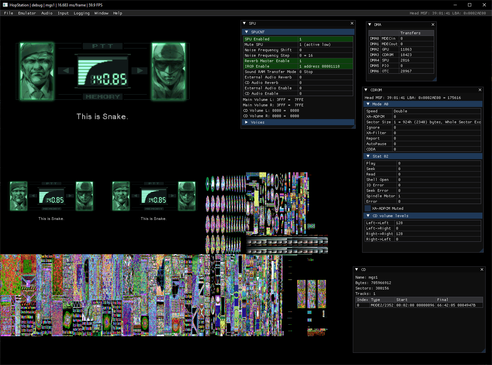

# HopStation

Work-in-progress but fully functional [PlayStation](https://en.wikipedia.org/wiki/PlayStation_(console)) (aka PSX, PS, PS1) emulator written in C++. 

The code is released as a reference for emulator developers etc. rather than to play games on. It is heavily commented and favours readability over performance. Many games now play, see [Compatibility.md](docs/Compatibility.md).

## Project motivation:
- Learn how the original PlayStation hardware works
- Learn a [RISC](https://en.wikipedia.org/wiki/Reduced_instruction_set_computer) CPU (I'd only done 68000 and Z80 previously)
- Emulate 3D hardware and write a software rasterizer
- Evaluate [SDL3](https://wiki.libsdl.org/SDL3) and [SDL GPU](https://wiki.libsdl.org/SDL3/CategoryGPU)
- The challenge!


|  |  |
| --- | --- |
|  |  |
|  |  |

## Key Features

### All major device components are emulated:
- R3000 CPU
- GPU (Graphics Processing Unit)
- DMA controller
- Interrupt controller
- CDROM
- GTE (Geometry Transformation Engine)
- SPU (Sound Processing Unit)
- MDEC (Motion video Decoder)
- Memory cards

### Application features
- Cross-platform windowed application
- Command line (headless) application (for testing)
- Disassembler
- Executable sideloading
- bin/cue CD image support (buggy)
- USB controller input
- Comprehensive configurable system logging (essential for debugging)
- VRAM viewer
- ImGui introspection windows 

## Known Issues

- Application asserts if CD is ejected during loading. Sorry! Just restart application.
- Buggy CUE sheet parsing prevents many games from loading e.g. *Tomb Raider*, *Wipeout*
- Inaccurate CDROM emulation reduces compatibility e.g. *Doom*
- SPU is missing features e.g. volume sweep and dynamic ADSR used in *Final Fantasy VII*

## Spoilers

Many emulator developers do not like spoilers, so I have hidden away some interesting things I discovered along the way in [SPOILERS.md](docs/SPOILERS.md)

## Building

CMake build tested on Windows, Ubuntu and macOS.

This project uses submodules. Either clone with `--recurse-submodules`

    git clone https://github.com/howprice/hopstation.git --recurse-submodules

or

    git clone git@github.com:howprice/hopstation.git --recurse-submodules

 or, after cloning (without submodules) run `git submodule update --init --recursive`

    git clone https://github.com/howprice/hopstation.git
    cd hopstation
    git submodule update --init --recursive

### Shaders

The shaders build with [SDL_shadercross](https://github.com/libsdl-org/SDL_shadercross). For Vulkan (Linux) this requires the spirv-cross-c dynamic library which is installed with the Vulkan SDK. Windows requires dxcompiler.dll and dxil.dll. The shadercross executable can be built locally or releases downloaded; see https://github.com/howprice/SDL_shadercross_build. 

Copy the shadercross executables and accompanying dynamic libraries into the `bin/<platform>/` folder (x64 is for Windows).

### Windows

1. Open a Visual Studio x64 Native Tools Command Prompt 
2. Run [hopstation/scripts/gensln.bat](hopstation/scripts/gensln.bat)

The Visual Studio solution and project files will be generated in `hopstation/build/`

Either:
1. Open the solution and build/debug from within the IDE
2. Run [hopstation/scripts/build.bat](hopstation/scripts/build.bat)

### Linux 

Install core Linux dependencies:

    sudo apt-get update
    sudo apt install -y build-essential curl zip unzip tar pkg-config autoconf autoconf-archive libtool ninja-build python3 python3-pip python3.12-venv libegl1-mesa-dev libxft-dev libwayland-dev

Please install all [SDL3 dependencies](https://wiki.libsdl.org/SDL3/README-linux) *before* building for the first time. Rebuilding SDL3 later with added dependencies, may require deleting the build folder *and* any cached vcpkg files (see build log). e.g. "Restored N package(s) from /home/&lt;user&gt;/.cache/vcpkg/archives"

SDL dependencies for Ubuntu 22.04 with all features:

    sudo apt-get install build-essential git make \
    pkg-config cmake ninja-build gnome-desktop-testing libasound2-dev libpulse-dev \
    libaudio-dev libfribidi-dev libjack-dev libsndio-dev libx11-dev libxext-dev \
    libxrandr-dev libxcursor-dev libxfixes-dev libxi-dev libxss-dev libxtst-dev \
    libxkbcommon-dev libdrm-dev libgbm-dev libgl1-mesa-dev libgles2-mesa-dev \
    libegl1-mesa-dev libdbus-1-dev libibus-1.0-dev libudev-dev libthai-dev zenity

(zenity is required for SDL_ShowOpenFileDialog())

Build from the command line using CMake or run [hopstation/scripts/build-linux.sh](hopstation/scripts/build-linux.sh)

### macOS

Use [hopstation/scripts/build-macos.sh](hopstation/scripts/build-macos.sh) and [psx-test/scripts/build-macos.sh](psx-test/scripts/build-macos.sh)

## Running the emulator

The windowed emulator application project is in the [hopstation/](hopstation/) folder.

A PlayStation BIOS file is required to run the emulator. The PlayStation BIOS are copyrighted software owned by Sony Interactive Entertainment. Instructions to dump the BIOS from your PlayStation console can be found online. Only tested with version SCPH1001 (Original US Launch).

Command line options:
```
--help                           Shows this message
--bios <path>                    Specify bios path. Default: bios/SCPH1001.bin
--disc <path>                    Insert disc (.cue file)
--exe <path>                     Sideload executable
--mcd <path>                     Load memory card from file
--amidog-debug                   Enable Amidog debug output for debugging test failures
-w --window-width                Window width. Default: 75% display width
-h --window-height               Window height. Default: 75% display height
-m --window-maximised            Maximise window. Default: false
-d --respect-display-dpi-scale   Default: false
--log-level <value>              Specify log level: 2 (trace), 1 (debug), 0 (info), -1 (warn), -2 (error) -3 (none)  Default: 0
```

### Controls

Two USB controllers should be detected, or the following keys can be used for the first pad (the second pad must currently use a USB controller):

| Button   | Key         |
|----------|-------------|
| Up       | Up arrow    |
| Down     | Down arrow  |
| Left     | Left arrow  |
| Right    | Right arrow |
| Start    | Return      |
| Select   | Backspace   |
| Cross    | X           |
| Circle   | D           |
| Square   | S           |
| Triangle | E           |
| L1       | 1           |
| L2       | 2           |
| R1       | 3           |
| R2       | 4           |
| L3       | Left ctrl   |
| R3       | Right ctrl  |

Left and right analogue sticks are mapped. For digital-only games, the left analogue stick can be mapped to the D-pad in the Input menu.


## Running headless tests

The headless command-line/console emulator application project is in the [psx-test/](psx-test/) folder. This is convenient for running tests. `psx-test` has very few dependencies and should build and run quickly.

See the source for more information. An important command line option is:

```
    --cycles-per-instruction <val> Set CPU cycles per instruction (2 for compat, 1 for Jakub timers test)
```

## Invaluable resources and heartfelt thanks

- The knowledgeable and extremely helpful emudev community
- [PlayStation Architecture - A practical analysis](https://www.copetti.org/writings/consoles/playstation/) by [Rodrigo Copetti](https://www.copetti.org/)
- [IDT R30xx Family Software Reference Manual](https://cgi.cse.unsw.edu.au/~cs3231/doc/R3000.pdf) (CPU)
- Lionel Flandrin's [Playstation Emulation Guide](https://github.com/simias/psx-guide) (dangerous holiday reading)
- Martin "Nocash" Korth for the original PSX specifications
  - [psx-spx (original)](https://problemkaputt.de/psx-spx.htm)
  - [psx-spx (modernized and actively maintained)](https://psx-spx.consoledev.net/)
- Jsgroth's amazing blog posts:
  - [PlayStation: The CPU](https://jsgroth.dev/blog/posts/ps1-cpu/)
  - [PlayStation: EXE Sideloading and the TTY](https://jsgroth.dev/blog/posts/ps1-sideloading/)
  - [PlayStation: A Bare Minimum GPU](https://jsgroth.dev/blog/posts/ps1-bare-minimum-gpu/)
  - [PlayStation: The Diamond](https://jsgroth.dev/blog/posts/ps1-diamond/)
  - [PlayStation: The SPU, Part 1 - ADPCM](https://jsgroth.dev/blog/posts/ps1-spu-part-1/)
  - [PlayStation: The SPU, Part 2 - Volume](https://jsgroth.dev/blog/posts/ps1-spu-part-2/)
  - [PlayStation: The SPU, Part 3 - Reverb](https://jsgroth.dev/blog/posts/ps1-spu-part-3/)
  - [PlayStation: The SPU, Part 4 - Everything Else](https://jsgroth.dev/blog/posts/ps1-spu-part-4/)
- stenzek for [Duckstation](https://github.com/stenzek/duckstation) 
- The Hitmen for their [PlayStation docs](http://hitmen.c02.at/html/psx_docs.html)
- Omar Cornut for [Dear ImGui](https://github.com/ocornut/imgui/)

### Tests

It would have been considerably more effort to build a working emulator without the following test suites:

- [Amidog's CPU and GTE tests](https://emulation.gametechwiki.com/index.php/PS1_Tests)
- https://github.com/PeterLemon/PSX
- https://github.com/JaCzekanski/ps1-tests
- https://github.com/simias/psx-hardware-tests/tree/master/tests
- https://github.com/nicolasnoble/pcsx-redux/tree/fuckit/src/mips/tests (tests no longer in main branch)

## Contributing

This is an unfinished personal project that I hope to continue in the future. It is shared as a learning resource for others. As such, feedback is welcomed, but feature contributions are unlikely to be accepted.

## License
This project is licensed under the MIT License - see the [LICENSE](LICENSE) file for details.
